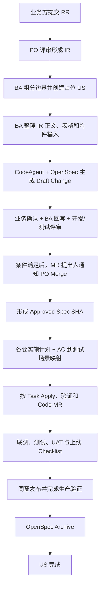
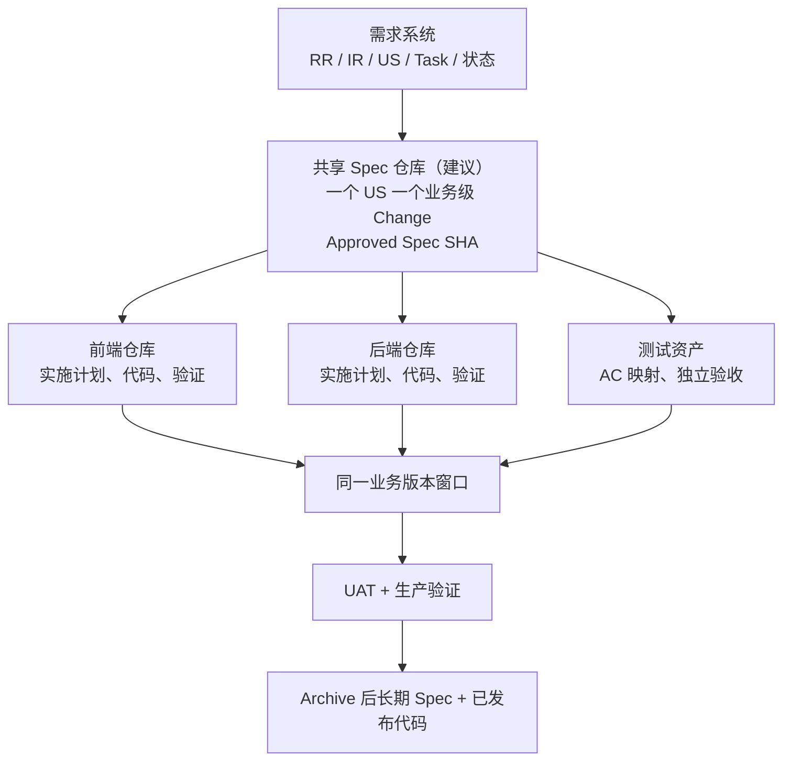

# 华为海思供应链 AI-SDD 综合报告 v1.0

> 文档状态：项目组内部评审稿
> 更新日期：2026-07-15
> 文档定位：整合 v0.1～v0.4 的当前一致方案，用于同事分享、试点评审和后续决策
> 边界说明：本文严格区分已确认事实、方案建议、待评审决策和技术 PoC，不替项目领导作出制度决定

## 一、执行摘要

本方案希望解决的不是“让 AI 多写代码”，而是让需求、规格、代码、测试与发布形成可追溯闭环。核心做法是：在 IR 与开发实施之间建立仓库内业务级 Spec，通过 MR 评审形成 Approved Spec，再由华为 CodeAgent 在工程 Harness 约束下辅助实施。

方案不替换现有 RR、IR、US、Task、UAT 和上线流程。需求系统继续管理来源、人员、排期和状态；代码仓库中经 MR 合入的 Spec，作为开发、测试和验收实际使用的需求基线。

当前真实交付并非“一个 US 只影响一个仓库”。一个 US 可以包含前端、后端、测试等 Task，前后端独立建仓、构建和发布，但必须在同一业务版本窗口完成测试、UAT、上线 checklist 和生产验证。

因此，当前一致模型是：一个 US 对应一个业务级 Approved Spec；前端、后端等实施仓库分别维护实施计划、代码和验证证据，并固定引用同一 Spec SHA。共享 Spec 仓库是推荐方案，是否采用仍需评审。

首版 Harness 不建设一键平台。后端开发者使用标准 Task 模板人工启动 CodeAgent，显式提供 Spec SHA、Standards SHA、实施计划、修改范围、验证命令、停止条件和人工接管条件。Task 的合适粒度不预设，在试点中记录并总结。

首轮试点重点验证可追溯性、需求理解质量、跨端契约质量、AI 可控性和人工接管能力。效率只作为观察指标，不能用一个案例直接宣称项目整体提效。

## 二、背景、现状与核心痛点

### 2.1 现有需求与交付链路

业务方下发 RR，经华为方 PO 评审后形成 IR；IR 进入 BA，BA 分析并拆解为 US；开发者在 US 下拆分后端、前端等 Task，测试人员维护测试 Task，各角色评估工作量和预计完成时间。

开发前通常会进行需求分析和反串讲。开发过程中发现新问题时，还会再次与业务方、BA、开发和测试澄清。版本发布前，需要完成前后端及测试 Task、UAT 验收、上线 checklist 和生产验证。

### 2.2 当前主要痛点

二次澄清结论可能分散在聊天、会议、邮件、US 正文或个人笔记中。即使 US 正文具备历史恢复能力，内容修改也不经过与代码一致的 MR 审批，开发者很难快速确认当前有效基线。

IR 中的表格和附件可能包含正式规则，旧附件又可能被替换或删除。若无法恢复当时文件本体，仅有上传时间和操作记录仍不足以证明 Spec 基于哪一版输入。

项目规范分散在大项目组和小组 Wiki 中。现有流水线能够执行构建、单元测试和静态检查，但未必能识别变量命名、SQL 规范等组内规则。AI 即使读到规则，也不代表会稳定执行。

前后端接口目前主要通过后端注解生成 Swagger。这能反映已实现接口，却不能天然充当前后端并行开发前的稳定契约，接口新增或变化仍可能在开发和联调阶段反复。

如果直接让 AI 根据不完整 US 写代码，AI 会放大输入中的歧义。Spec 也不能一次写完后冻结不动；开发发现的新事实必须先回到 Spec，经评审形成新基线，再驱动受影响 Task。

## 三、目标、范围与设计原则

### 3.1 目标

- 建立从 RR、IR、US、Spec、Task、测试、代码、UAT 到发布的追溯链。
- 让业务方、BA、开发和测试围绕同一份可评审规格对齐。
- 用 Approved Spec 和项目规范约束 CodeAgent，提升生成代码的可控性。
- 让需求变化先更新规格，只重新启动受影响实施工作。
- 保留人工实现和人工接管路径，不把 AI 生成率当成交付目标。

### 3.2 当前范围

流程覆盖一个跨前后端的业务 US，从 IR 分析、占位 US、Spec MR、实施、测试、UAT、上线到 Archive。当前 Harness 的执行细化聚焦后端；前端继续参与契约评审、联调、UAT 和同窗发布。

本文不设计新的 MR 合并权限，不替换现有需求看板，不强制推动前后端合仓，也不预设 CodeAgent Task 的时间、文件数或代码行数阈值。

### 3.3 设计原则

1. **Spec-first**：业务行为、AC 或跨仓契约发生变化时，先修改 Spec，再修改代码。
2. **单一生效基线**：开发与测试只认代码仓库中经 MR 合入的 Approved Spec。
3. **管理与工程分工**：US 管理人员、排期、Task 和状态；Spec 管理可执行需求。
4. **业务与技术分层**：业务方确认业务场景和预期结果，专业角色负责技术和测试细节。
5. **版本固定**：Task 绑定明确的 Spec SHA 与 Standards SHA，不自动追随“最新版本”。
6. **证据优先**：以 MR、Diff、构建和测试结果为证据，不以 AI 的完成声明为证据。
7. **允许降级**：AI 不合格时可人工接管，但不得绕过 Spec、测试和 MR 门禁。

## 四、RR → IR → 占位 US → Approved Spec 主流程



### 4.1 从 IR 到占位 US

BA 先对 IR 做粗略业务边界划分，再创建占位 US，以获得稳定 US ID、维护 IR 关联、分配前后端和测试 Task，并承载排期管理。占位 US 处于“规格准备中”，不代表需求已具备开发准入条件。

如果分析后需要继续拆分，BA 可以修改原 US 范围并创建关联 US。若相关 Spec 已形成 Approved 基线，拆分带来的有效需求变化仍须先通过 Spec MR；仅修改 US 不对开发生效。

### 4.2 IR 输入整理

BA 将当前 US 使用的 IR 文本、表格和附件规则结构化，标出来源位置、开放问题和假设。对于可能被替换的附件，建议记录文件名、上传时间、大小、哈希及受控存储位置。

附件快照应存放在代码仓库、Git LFS 还是内部制品库，当前尚未确定。首轮可优先选择文本为主、附件可恢复的真实需求，降低工具能力尚未验证带来的风险。

### 4.3 Draft、Review 与 Approved

Draft Spec MR 用于澄清，不必等所有问题解决后才创建。业务方主要确认业务目标、场景、规则、范围和预期结果；BA 将会议或线上确认结论回写正文；开发和测试完成技术可行性与可测试性评审。

有效结论必须进入 Spec 正文。MR 评论、会议纪要和聊天可以保存讨论过程，但不能代替最终规格。阻塞问题清零、正文一致、必要评审完成后，MR 才达到可合入状态。

现有平台中所有 MR 只有华为 PO 可以执行最终 Merge。条件满足后由 MR 提出人通知 PO 合并；通知只承担提醒作用，正式审批证据必须留在 MR 内。该机制按现状执行，不纳入首轮改造范围。

Merge 后以 Change 路径和提交 SHA 唯一定位 Approved Spec。它描述已经批准、尚待或正在实现的未来行为；只有发布完成并 Archive 后，长期 Spec 才代表当前已实现行为。

### 4.4 Spec 到 US

Approved Spec 合入后，应把业务摘要、OpenSpec Change ID、Spec 链接和 Approved Commit SHA 同步到 US。US 继续是管理入口，但任何仅在 US 中新增的业务内容，在通过 Spec MR 前都不对开发生效。

首次同步、后续同步及一致性检查由 BA、项目经理还是工具负责，目前待评审。DevOps API 是否支持安全自动同步也待验证，因此 v0.1 可以先人工同步。

### 4.5 估算时点

建议采用两阶段估算：Spec 前根据占位 US 给区间粗估，用于资源安排；Approved Spec、实施计划和测试映射明确后，再拆 Task 并给正式估算。是否采用以及责任人、承诺口径，应由项目领导评审决定。

## 五、业务级 Spec、多仓实施与事实源边界

### 5.1 多仓关系



一个 US 只有一个业务级 Spec，描述用户价值、范围、业务规则、异常场景、验收标准和跨仓共同契约。各实施仓库只维护本仓实施计划、Task、项目规范、代码、构建和验证证据，不复制出可独立修改的第二份业务 Spec。

共享 Spec 仓库是当前推荐方案。前后端独立构建、独立发布、权限边界不同，因此不建议仅为 SDD 或 AI 读取便利而推动合仓。是否新建共享仓库仍由项目组评审。

### 5.2 事实源边界

| 信息 | 当前或建议事实源 | 说明 |
|---|---|---|
| RR、IR、优先级、上游范围 | 华为需求系统 | 保留现有需求治理 |
| Spec 使用的正文、表格和附件版本 | IR 输入快照或清单 | 证明分析输入版本 |
| 人员、排期、工时、Task 与状态 | US / Task 看板 | US 正文历史可查看和恢复 |
| 已批准的未来系统行为 | Approved OpenSpec Change | 以 MR 合入 SHA 定位 |
| 实施方式与验证证据 | 各实施仓库 | 固定引用 Spec SHA |
| 当前已实现系统行为 | Archive 后长期 Spec + 已发布代码 | 必须经过上线和生产验证 |

当不同载体出现冲突时，先按信息类型判断权威来源。开发行为、业务规则、验收标准和共同契约以 Approved Spec 为准；排期和人员状态以需求管理系统为准。

## 六、角色、评审与现有 MR 约束

### 6.1 角色责任

| 角色 | 主要责任 |
|---|---|
| 项目组负责人 Sponsor | 批准和推动试点，协调跨项目资源与重大决策 |
| 唯一 PM Owner（建议指定） | 日常推进、跨仓协调、门禁跟踪、指标收集和争议升级 |
| 业务方 | 确认业务场景、规则、范围、预期结果并出具 UAT 结论 |
| 华为 PO | 按现有权限执行所有 MR 的最终 Merge；重大业务争议按需升级 |
| BA | 拆 US、整理输入、维护业务语义、回写确认结论和管理追溯 |
| 后端接口人 | 主导接口定义，审批后端实施计划和技术可行性 |
| 前端接口人 | 评审接口可用性，提出新增或变更需求，参与联调和发布 |
| 测试接口人 | 审批 AC 到测试场景映射，负责技术测试完整性 |
| CodeAgent | 在授权范围内生成和校验制品，不承担批准责任 |

Sponsor、PM Owner 及各专业角色不能相互替代。PM 可以组织争议处理，但不能代替业务方批准业务结果，也不能代替开发和测试批准专业内容。

### 6.2 唯一 BA 下的独立验证

当前项目只有一名 BA，不能设计“第二 BA 必须审批”的不可执行门禁。开发或测试发起 Draft Spec MR 时，由 BA 审批业务含义；BA 发起时，由业务方明确确认、项目经理见证，形成独立业务验证。

无论谁发起 MR，开发和测试仍需分别完成技术与可测试性评审。BA 作为作者不等于可以独自确认业务正确，项目经理见证也不等于代替业务方作决定。

### 6.3 MR 现有约束

任一项目角色都可创建 Draft Spec MR，但业务语义变化必须经过 BA。所有评审结论和处理结果保存在 MR 内；MR 满足条件后，由提出人通知 PO 执行 Merge。

PO 在普通 MR 中执行合并按钮，不等于重新承担全部业务内容评审。涉及范围、优先级、里程碑或重大争议时，是否升级 PO 决策，继续按现有需求治理规则处理。

## 七、CodeAgent Harness、规范治理与 Task 执行

### 7.1 Harness 的作用

Spec 提供“做什么”，Harness 负责限制“AI 如何做、做到什么程度才算完成”。高质量代码不能只依靠 Spec，还需要实施计划、项目规范、构建测试、独立验收和人工评审共同约束。

当前指定工具是华为基于开源 OpenCode 二次开发的 CodeAgent，并接入内部部署模型。已知它能读取代码仓库和项目级指令，但与 OpenCode、OpenSpec 的具体兼容行为仍需实测，不能用“应该一致”替代验证。

### 7.2 三层上下文

| 层级 | 内容 | 固定标识 |
|---|---|---|
| 业务规格层 | Approved Spec、AC、跨仓契约、决策 | Spec SHA |
| 项目规范层 | 架构、编码、SQL、测试、安全、构建规范 | Standards SHA |
| Task 执行层 | 当前任务、实施计划、修改范围、验证和停止条件 | Task ID + Plan Version |

每个 Task 开始时绑定明确版本。Spec 或规范更新后，只对受影响 Task 做影响分析和重新确认，不让所有会话无条件读取最新内容。

### 7.3 项目规范治理建议

建议把分散规范整理为四层：L0 企业安全与合规；L1 大项目统一强制规则；L2 小组补充或收紧规则；L3 仓库命令和经批准例外。下层规则不能静默弱化上层规则。

建议由小组开发负责人担任 Standards Owner，先整理 10～20 条高频强制规则。每条规则包含唯一 ID、来源、适用范围、优先级、正反例、自动检查能力以及例外与冲突升级方式。

规则集以 Git 提交固定为 Standards SHA。CodeAgent 遇到规则冲突应停止并报告，不能自行选择更宽松规则。治理模型、Owner 和首批规则范围都属于建议，须经项目组评审。

### 7.4 v0.1 标准 Task 模板

首版不开发一键命令或新平台，由后端开发者按模板人工启动 CodeAgent。模板至少包含：

- US ID、Task ID；
- Approved Spec SHA、Standards SHA；
- 已批准实施计划或版本；
- 允许修改的仓库、模块和文件范围；
- 构建、单测、静态检查和其他验证命令；
- 必须停止并请求确认的条件；
- AI 失败后的人工接管条件与交接内容。

Task 完成以实际 Diff 和命令结果为准。连续生成不合格、无法稳定验证或超出范围时，允许开发接口人决定人工接管；接管仍须遵守同一 Spec、测试和 MR 门禁。

首轮不规定 AI 执行单元必须持续几小时或几天，也不限制固定文件数。试点记录复杂度、持续时间、上下文长度、修改文件数、验证轮次、中断和接管，再形成适合项目的拆分规则。

### 7.5 五道质量门禁

1. Spec 质量：目标、范围、业务规则、AC、异常和依赖清楚。
2. 计划准入：开发接口人批准当前仓库实施计划；高风险项按需专项评审。
3. 小步实施：按 Task 生成与审查，限制修改范围，允许局部重试。
4. 自动验证：执行构建、单测、静态检查及可自动化的项目规范。
5. 独立审查：人工 Code Review 与独立验收会话检查 Spec 一致性。

## 八、测试、UAT、上线、Archive 与变更控制

### 8.1 测试分层与会话隔离

业务验收场景写在同一 OpenSpec Change 中，描述前置条件、业务操作、预期结果和关键异常，由业务方确认。详细技术测试用例独立维护，并引用 Change ID、AC ID 和 Approved Spec SHA。

测试接口人在代码生成前完成 `业务规则 BR → 验收标准 AC → 测试场景 TS` 映射。业务方只评审业务场景和预期结果，不承担接口参数、数据库校验或自动化脚本审批。

验收测试与业务代码不得由同一 CodeAgent 会话生成。开发会话可生成单元测试；独立验收会话只依据 Approved Spec、AC、公开契约和必要环境进行设计或审查，由测试接口人最终批准。

### 8.2 跨端接口契约

后端接口人主导接口初稿，前端接口人评审可用性并提出新增或变更需求，测试接口人检查异常码、边界和可测试性。纯技术调整走专业评审；影响业务规则或 AC 时必须更新业务级 Spec。

当前 Swagger 由后端注解自动生成，属于实现后的派生产物。建议在试点新增或显著变更的接口上探索增量 contract-first OpenAPI，再与实际 Swagger 校验。是否采用、文件位置和校验方式均待评审。

### 8.3 开发中的 Spec-first 变更

```text
发现问题
  → BA 初判是文字澄清、技术修正还是需求变化
  → 开发和测试校验影响
  → 争议由项目经理组织处理，必要时业务确认
  → 更新业务级 Spec 并提交 MR
  → 按影响范围重新评审并形成新 Spec SHA
  → 仅恢复受影响 Task
```

只冻结受影响 Task 的前提是接口、数据、依赖和测试影响可以隔离。若影响无法界定，应扩大冻结范围。任何聊天或 US 中的新增内容，在 Spec MR 合入前都只是输入或变更请求。

### 8.4 UAT 与同窗上线

业务方通过邮件回复 UAT 验收结果，并将验收报告附件上传 US。报告应能关联 US、Approved Spec SHA 和验收场景；建议记录邮件时间、确认人、报告版本和文件哈希。

前端 Task、后端 Task、测试 Task、跨端回归、UAT 和上线 checklist 全部完成后，才能进入同一业务版本窗口。部署完成不等于上线成功，生产验证通过且无需立即回滚后才算成功。

### 8.5 Archive 与 US 完成

OpenSpec Archive 不作为上线前硬门禁，避免文档操作阻塞正常发布；但 Archive 是 US 完成门禁。Archive 将已经实现的 Change 并入长期 Spec，使长期规格与生产行为保持一致。

Archive 的 Owner、完成时限和逾期处理仍待评审。若归档发现实现与 Approved Spec 不一致，必须显式记录偏差并走补充变更，不能直接把实际代码静默覆盖成“正确规格”。

### 8.6 紧急通道

生产故障或安全事件可能需要先止损再补 Spec。是否允许 code-first、适用条件、授权人、补 Spec 时限和复盘要求，都需要项目组负责人评审批准；普通排期压力不能默认使用紧急例外。

## 九、试点方案、指标与分阶段路线

### 9.1 试点对象

选择一个真实、业务边界较清晰、中等复杂度、跨前后端且非紧急的 US。业务方能及时参与，后端已有稳定构建、单测、静态检查和 MR 流水线；前端按现有方式参与契约、联调、UAT 和发布。

可选择一个复杂度接近的历史 US 作为对照，收集澄清、开发周期、返工和缺陷数据。只有一组对照时，结论属于案例验证，不能外推为项目整体效果。

### 9.2 首轮成功标准

1. IR、Spec、Task、代码、测试、UAT 和发布能完整追溯。
2. 需求理解错误和接口返工能够更早发现或减少。
3. CodeAgent 能受 Spec、规范和修改范围约束。
4. 独立验收能够发现实现偏差。
5. AI 失败后能以低损失切换人工实施。

首次搭建流程可能使交付时间变长。只要追溯链跑通、需求理解和接口返工明显改善，仍可判定试点具有价值；但额外投入必须如实记录，供第二、第三个 US 观察趋势。

### 9.3 建议指标

| 维度 | 指标示例 |
|---|---|
| 规格 | Draft 到 Approved 耗时、评审发现问题数、开发中 Spec 变更数 |
| 质量 | 需求理解类缺陷、接口返工、测试与 Review 发现问题 |
| AI | 成功率、重试次数、人工修改量、接管次数和接管成本 |
| 追溯 | BR→AC→TS→Task→Commit 的覆盖率、证据缺失数 |
| 交付 | UAT、生产验证、Archive 时间及整体周期 |
| 成本 | 各角色新增评审时间、规范整理和工具准备投入 |

指标用于判断流程和工具，不用于个人绩效。AI 代码接受率也不能单独代表质量；必须结合缺陷、返工、验证和人工修改一起解读。

### 9.4 分阶段路线

**阶段 0：准备。** 选定 Sponsor、唯一 PM Owner、试点 US 和历史对照；整理后端命令、首批规范、Task 模板及 CodeAgent/OpenSpec PoC 清单。

**阶段 1：端到端案例验证。** 完成占位 US、Draft Spec、评审、后端 AI 实施、前端协作、独立测试、UAT、同窗上线、生产验证和 Archive。

**阶段 2：复盘与固化。** 根据数据调整模板、门禁、规范条目、Task 拆分信号和人工接管规则，明确同步、Archive 与紧急通道责任。

**阶段 3：增量自动化。** 在平台能力确认后，再探索 Jenkins 校验、US 同步、会话证据、跨仓 Spec 注入和规则自动检查，不提前建设复杂 Harness 平台。

## 十、状态清单：事实、建议、待评审与 PoC

### 10.1 已确认事实

- 需求链路为 RR → IR → BA 拆 US → 开发/测试拆 Task。
- 一个 US 包含前端、后端和测试等多个 Task。
- 前后端独立仓库、独立构建和发布，但需要同一业务版本窗口交付。
- 当前 Harness 执行细化聚焦后端，前端参与契约、联调、UAT 和发布。
- CodeAgent 基于 OpenCode 二次开发，使用华为内部模型，可读取仓库和项目级指令。
- 当前只有一名 BA；BA 发起 MR 时采用业务方确认加项目经理见证。
- 任一角色可创建 Draft Spec MR，业务含义变化必须经过 BA。
- 所有 MR 只有华为 PO 可 Merge；条件满足后由 MR 提出人通知。
- US 正文历史可以完整查看和恢复，附件历史恢复能力不确定。
- Swagger 目前由后端代码注解生成。
- UAT 由业务方邮件确认，报告附件上传 US。
- 前后端、测试、UAT、上线 checklist 和生产验证完成后才算上线成功。
- 一切开发与测试依据以仓库中经 MR 合入的 Spec 为准。
- 公开仓库仅用于方法论和文档整理，真实材料留在内部环境。

### 10.2 当前方案建议

- 建立共享 Spec 仓库，一个 US 一个业务级 Approved Spec。
- 实施仓库分别维护计划、代码和验证，并固定引用 Spec SHA。
- 每个 Task 绑定 Spec SHA、Standards SHA 与已批准计划。
- v0.1 使用标准 Task 模板人工启动 CodeAgent。
- 实现会话与验收测试会话隔离。
- 开发接口人批准实施计划，测试接口人在代码前批准测试映射。
- 采用 L0～L3 规范分层并先整理高频强制规则。
- 开发中执行 Spec-first，只冻结受影响 Task。
- 对新增或显著变更接口探索增量 contract-first OpenAPI。
- Sponsor 指定唯一 PM Owner 推进试点。
- Archive 不阻塞上线，但阻塞 US 最终完成。

### 10.3 待项目组或领导评审

1. 是否建立共享 Spec 仓库及其 Owner、权限和评审规则？
2. Spec 到 US 的同步和一致性检查由谁负责？
3. 是否采用两阶段估算，以及正式承诺的责任与口径？
4. 是否采用增量 contract-first OpenAPI，文件放在哪里、如何校验？
5. L0～L3 规范治理是否采纳，Standards Owner 由谁担任？
6. Archive 的 Owner、时限和逾期处理是什么？
7. 是否建立紧急 code-first 通道，授权和补 Spec 规则是什么？
8. IR、US 和 UAT 附件是否需要额外版本化存储？
9. 高风险专项评审的触发条件和参与角色是什么？
10. 前端 AI 实施和质量基建何时纳入后续试点？

### 10.4 技术 PoC 待验证

1. CodeAgent 是否每次会话都自动加载并稳定遵循项目指令？
2. CodeAgent 如何固定读取共享 Spec 仓库与当前实施仓库？
3. 是否支持 OpenSpec Change、CLI 校验、中文 Spec 和跨会话恢复？
4. 是否能限制修改范围，并稳定运行构建、测试和检查命令？
5. 是否能导出会话 ID、工具/模型版本、摘要和验证证据？
6. 标准 Task 模板能否稳定约束输入、停止条件和人工接管？
7. Jenkins 能否运行固定版本 OpenSpec validate 并形成门禁？
8. DevOps API 能否支持安全的 US 同步和一致性检查？
9. US 附件能否查看和恢复历史文件本体？
10. 多层规范冲突、长上下文和跨会话下，CodeAgent 是否仍稳定遵循优先级？
11. 独立验收会话能否输出可复现、可审计证据？
12. 不同后端 Task 的合适 AI 执行粒度和拆分信号是什么？

## 十一、主要风险与应对

| 风险 | 可能表现 | 当前应对 |
|---|---|---|
| Spec 变成额外文档负担 | 前期耗时增加、正文重复 | 只写可执行信息，复用上游编号，不复制完整 IR |
| Spec 与 US 双写漂移 | 两边内容不同 | Spec 为开发基线，US 只作管理入口并记录 SHA |
| 附件被替换 | 无法证明输入和验收版本 | 记录哈希、时间和受控快照；能力待验证 |
| AI 读取但不遵守规范 | 命名、SQL、架构规则被忽略 | Standards SHA、规则 ID、显式注入、自动检查和人工审查 |
| 多仓契约不一致 | 前后端联调返工 | 一个业务级 Spec、共同契约、同一 Spec SHA |
| AI 自写自测自证 | 验收偏向实现 | 实现会话与验收会话隔离，测试接口人审批 |
| 试点变量过多 | 无法判断失败原因 | 当前执行聚焦后端，分端记录指标，前端按现有方式参与 |
| 为追求 AI 成功拖延交付 | 重试失控 | 预设停止和人工接管条件 |
| Archive 长期拖欠 | 长期 Spec 与生产不一致 | Archive 阻塞 US 完成，Owner 和时限待评审 |
| 公开仓泄露内部信息 | 真实需求或链接外流 | 公开仓只留方法、模板和脱敏示例，发布前人工检查 |

## 十二、术语与版本演进附录

### 12.1 术语

| 术语 | 本文含义 |
|---|---|
| RR | 业务方下发的原始需求 |
| IR | 经 PO 评审后进入 BA 分析的需求输入 |
| US | 用户故事及管理视图，承载人员、Task、排期和状态 |
| Spec | 结构化、可评审、可执行的需求与验收规格 |
| Approved Spec | 经 MR 合入、以提交 SHA 定位的当前开发基线 |
| OpenSpec Change | Proposal → Review → Apply → Archive 的一次规格变更 |
| Archive | 实现发布后，把 Change 并入长期 Spec 的动作 |
| Harness | 约束 AI 输入、计划、权限、验证、证据和接管的工程机制 |
| Standards SHA | 当前 Task 使用的项目规范版本 |
| AC | Acceptance Criteria，验收标准 |
| UAT | 业务方进行的用户验收测试 |
| 同窗上线 | 前后端及测试制品进入同一业务版本窗口交付 |

### 12.2 v0.1～v0.4 演进

| 版本 | 主要贡献 | 已被修正或吸收的内容 |
|---|---|---|
| v0.1 初步报告 | 建立 Draft → Ready → Merge 的 Spec MR 思路和事实源边界 | “单 US 单仓”仅保留为早期假设 |
| v0.2 阶段方案 | 引入 OpenSpec、CodeAgent、IR 输入快照、质量门禁和 PoC | 正式 US 在 Spec 后创建改为先建占位 US；单仓映射被推翻 |
| v0.3 阶段方案 | 明确一个业务级 Spec、多实施仓库、同窗交付和独立验收 | 被 v0.4 的实际组织与执行约束进一步细化 |
| v0.4 阶段方案 | 补充唯一 BA、PO Merge 现状、后端 Task 模板、实践观察与公开仓边界 | 作为本综合报告的主要当前基础 |

早期文档用于理解思路演进，不应继续作为当前制度或目标模型直接执行。尤其是“一个 US 对应一个代码仓库”的假设，已被前后端分仓且同窗交付的事实明确推翻。

### 12.3 与首版流程规范的关系

[[华为海思供应链SDD需求到Spec-MR规范-v0.1]] 保留了 Draft、Ready、Merge、结论回写和提交 SHA 基线等仍然有效的基本原则。但其中“开发者接收 US 后开始建 Spec”和“一个 US 一个代码仓库”属于早期约束，实施时以本报告的占位 US、多仓模型为准。

## 相关笔记

- [[华为海思供应链AI-SDD阶段性方案-v0.4]]
- [[华为海思供应链AI-SDD阶段性方案-v0.3]]
- [[华为海思供应链AI-SDD阶段性方案-v0.2]]
- [[华为海思供应链SDD初步探索报告-v0.1]]
- [[华为海思供应链SDD需求到Spec-MR规范-v0.1]]
- [[项目首页]]
