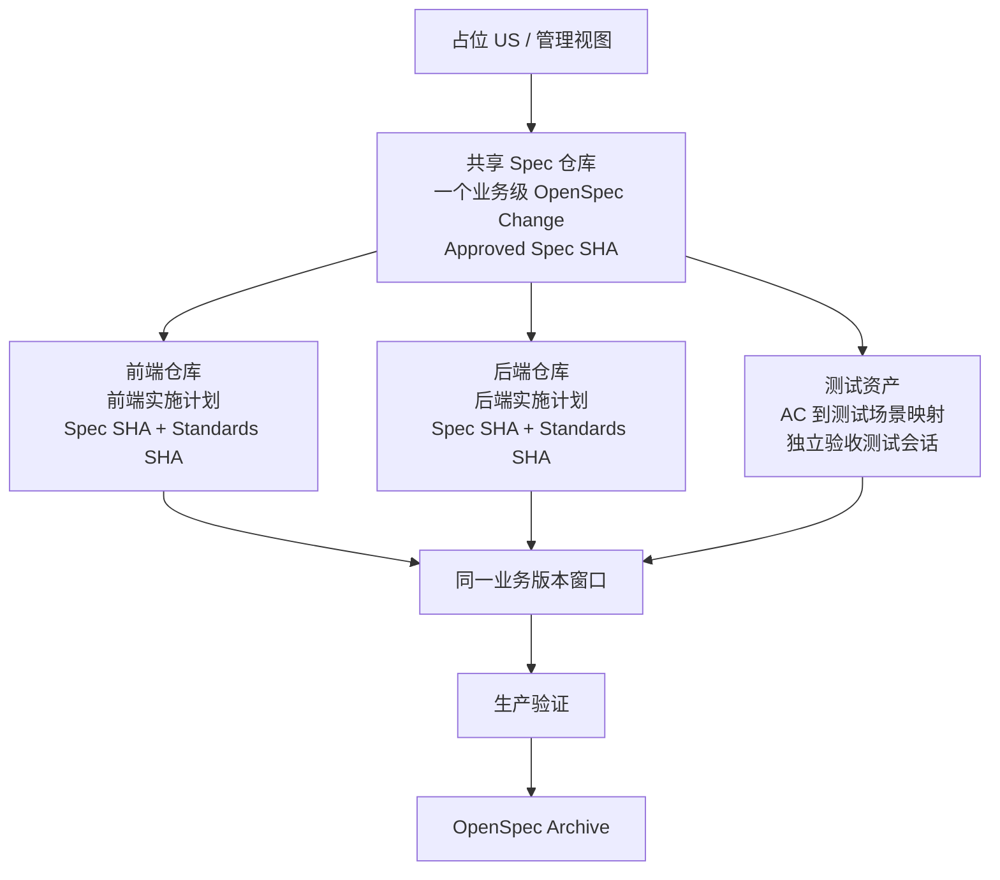

# 华为海思供应链 AI-SDD 阶段性方案 v0.4

> 文档状态：项目组内部讨论稿
> 更新日期：2026-07-15
> 文档边界：区分已确认事实、方案建议、待评审决策和技术 PoC 待验证，不代表现行制度

## 一、执行摘要

本方案探索的不是“用 AI 多写代码”，也不是单纯把 Spec 提交到仓库，而是建立一套可治理、可追溯、允许人工接管的 AI 研发闭环：

> 以业务级 Approved Spec 为共同基线，驱动多个实施仓库中的 CodeAgent 分别生成计划、测试和代码，再通过独立构建、联合验收、同一业务版本窗口和生产验证完成交付。

一个 US 通常包含前端、后端和测试等多个 Task。前后端代码位于独立仓库，具有独立的构建和发布过程，但需要在同一个业务版本窗口完成交付。因此，v0.2 中“一个 US 只影响一个代码仓库”的前提不成立，v0.4 延续以下多仓业务交付模型：

```text
一个 US
  → 一个业务级 Approved Spec
  → 多个实施仓库
  → 每个仓库一份实施计划和一组 Task
  → 独立构建、联合验收、同窗上线
```

本方案建议优先采用共享 Spec 仓库承载一个 US 的业务级 OpenSpec Change，各实施仓库引用同一个 Spec Commit SHA，并使用各自的项目规范和实施计划。是否调整为前后端合仓仍可评审，但不建议仅为了 SDD 而合仓。

首轮试点整体仍选择跨前后端 US，并验证契约、联调、UAT 和同窗上线；但当前 Harness 的可执行细化聚焦后端。前端沿用现有开发方式参与业务交付，暂不把前端仓库质量基建改造设为试点硬前置。

## 二、主流程

```text
业务方提交 RR
  → PO 评审形成 IR
  → BA 拆分候选 US 的业务边界
  → 创建占位 US，保留编号和上下游关系
  → 项目经理分配前端、后端、测试接口人及目标仓库
  → BA 整理 IR 正文、表格和附件输入
  → CodeAgent + OpenSpec 生成业务级 Change 草案
  → 任一角色创建 Draft Spec MR
  → 业务方评审业务场景和预期结果，BA 审批业务含义变化
  → 开发和测试分别完成专业评审
  → 内容评审和合入条件满足后，由 MR 提出人通知华为 PO
  → 华为 PO 执行最终 Merge，形成 Approved Spec
  → 更新 US 摘要、Spec 链接和 Commit SHA
  → 各实施仓库生成独立实施计划
  → 开发接口人批准计划，测试接口人批准 AC 到测试场景映射
  → 各仓库按 Task 小步 Apply、测试、Code MR
  → 前后端联调及独立验收测试会话
  → 业务 UAT，邮件确认并把报告附件上传 US
  → 前端 Task、后端 Task、测试 Task、UAT、上线清单全部完成
  → 同一业务版本窗口上线
  → 生产验证通过，判定上线成功
  → 限时 Archive，更新长期 Spec
  → US 完成
```

开发中如果发现需求问题，执行 Spec-first 变更。只冻结受影响的 Task，不默认阻塞整个 US；新 Spec MR 合入后，受影响仓库绑定新的 Spec SHA 再继续实施。

## 三、多仓库资产关系



### 3.1 业务级 Spec

一个 US 建议只有一个业务级 Approved Spec，集中描述：

- 用户价值、范围和非目标；
- 业务场景、规则、异常与预期结果；
- 前后端共同遵守的接口和数据契约；
- 验收标准及跨仓依赖；
- 业务确认、评审和变更历史。

业务验收场景与工程规格放在同一个 OpenSpec Change 中，避免另建一份无法同步的 UAT 需求文档。业务方只需要评审业务场景和预期结果，不要求评审技术设计、测试实现或代码。

### 3.2 实施仓库

前端、后端及其他实施仓库分别维护：

- 当前仓库的实施计划和 Task；
- 所引用的业务级 Spec Commit SHA；
- 所引用的项目规范 Standards SHA；
- 构建、测试、发布和回滚命令；
- 该仓库产生的 Code MR 和验证证据。

各仓库独立构建、独立发布，但不能把“单仓构建成功”当作业务交付完成。只有跨仓 Task、UAT、上线清单和生产验证全部满足条件，才完成业务版本交付。

### 3.3 是否前后端合仓

前后端合仓可以作为架构和研发治理议题单独评审，但不是采用 SDD 的必要条件。仅为了让 AI 读取方便而合仓，会引入权限、流水线、发布边界和历史迁移成本，当前不推荐。

## 四、CodeAgent Harness 与规范分层

### 4.1 当前能力边界

已确认 CodeAgent 能读取代码仓库和项目级指令。以下能力不能直接假设成立，需要 PoC 验证：

- 新会话是否自动加载正确的项目指令；
- 模型是否稳定遵循规则，而不是只读到文件；
- 能否同时关联共享 Spec 仓库与当前实施仓库；
- 跨会话能否恢复同一 Change 和 Task；
- 是否支持导出会话、Prompt、命令和验证证据；
- 是否能限制修改范围，并在未经批准时阻止提前写业务代码；
- 是否能稳定执行 OpenSpec CLI、构建和测试命令。

### 4.2 规范分层建议

建议把 AI 上下文分为三层：

| 层级 | 内容 | 版本标识 |
|---|---|---|
| 业务规格层 | Approved Spec、AC、跨仓契约、决策记录 | Spec Commit SHA |
| 项目规范层 | 架构、编码、测试、安全、构建和发布规范 | Standards Commit SHA |
| Task 执行层 | 当前 Task、文件范围、计划、验证命令和停止条件 | Task ID + Plan Version |

每个 Task 开始前必须记录所使用的 `Spec SHA` 和 `Standards SHA`。后续 Spec 或规范发生变化时，才能准确识别哪些 Task 需要重算影响，而不是让所有 AI 会话自动追随“最新版本”。

### 4.3 项目规范治理建议

当前项目规范既有大项目组层面的统一要求，也有分散在各小组 Wiki 中的补充约定。若直接把所有材料一次性交给 CodeAgent，容易出现重复、冲突、过期内容和优先级不明。建议评审以下四级治理模型：

| 层级 | 内容 | 约束关系 |
|---|---|---|
| L0 企业级 | 安全、合规、数据和工具使用红线 | 所有项目不可绕过 |
| L1 大项目级 | 架构、质量、发布和通用工程强制规则 | 所有小组和仓库必须继承 |
| L2 小组级 | 结合业务域和技术栈形成的补充规则 | 只能补充或收紧上层规则 |
| L3 仓库级 | 特定仓库的必要例外、命令和局部约定 | 必须记录原因、范围、批准人和有效期 |

下层规范不得静默弱化上层规范。发现冲突时，CodeAgent 应停止相关 Task 并显式报告，由 Standards Owner 组织升级确认，不能自行选择更宽松的规则。

建议由小组开发负责人担任 Standards Owner，先从现有大项目规范和小组 Wiki 中整理 10～20 条高频、强制、能够显著影响代码质量的规则开展试点。每条规则至少包含：

- 唯一规则 ID；
- 原始来源和维护责任人；
- 适用范围及优先级；
- 正例与反例；
- 是否可以通过 lint、测试或脚本自动检查；
- 例外申请和冲突升级方式。

规则集以 Git 版本固定为 `Standards SHA`，每个 Task 都绑定明确版本。CodeAgent 能否自动加载并稳定遵循多层规范仍待 PoC；在此之前，Harness 应把当前 Task 适用的规则清单、优先级、`Standards SHA` 和冲突停止条件显式注入会话。

以上分层、Standards Owner 和首批规则范围均为方案建议，治理模式是否采纳以及由谁承担责任，必须由项目组评审决定，不代表现行制度。

### 4.4 v0.1 Harness 的启动方式

首版 Harness 不开发一键式平台，也不把流程自动化程度作为试点门槛。建议采用标准 Task 模板，由开发者在后端仓库中人工启动 CodeAgent，并把每次执行的输入和结果保留在 Task 或 Code MR 中。

标准 Task 模板至少包含：

- US ID；
- Task ID；
- Approved Spec SHA；
- Standards SHA；
- 已批准的实施计划或对应版本；
- 允许修改的仓库、模块和文件范围；
- 构建、单元测试、静态检查及其他验证命令；
- 必须停止并请求确认的条件；
- AI 失败后的人工接管条件和交接内容。

开发者根据模板显式提供上下文并启动 CodeAgent，CodeAgent 不得自行扩大修改范围。任务完成后，以实际命令结果和 Diff 作为证据，不以 AI 的完成声明作为证据。

首轮不预设“一个 CodeAgent 执行单元必须在 1～2 天内完成”、固定文件数量或固定代码行数。应在真实试点中记录任务复杂度、持续时间、上下文长度、修改文件数、中断次数和人工接管情况，再总结适合本项目的拆分规则。

### 4.5 独立验收测试会话

建议实现会话和验收测试会话相互独立。验收会话只读取 Approved Spec、AC、公开接口和必要测试环境，不继承实现会话的推理与自我声明，从而降低 AI 自写、自测、自证带来的偏差。

如果 AI 执行失败、输出不稳定或无法继续，允许开发和测试人工接管。人工接管必须保留当前 Spec SHA、已完成 Task、验证结果和未完成项，不能以“必须让 AI 完成”为试点成功条件。

## 五、评审与批准责任

| 对象 | 主要批准人 | 说明 |
|---|---|---|
| Draft Spec MR 创建 | 任一项目角色 | 创建 MR 不等于批准业务含义或允许合入 |
| 业务场景、规则、范围和预期结果 | 业务方，BA 负责回写 | 业务方不承担技术评审 |
| 业务含义变化 | BA | 所有改变业务语义的 Spec 内容必须经 BA 审批 |
| 各仓库实施计划 | 对应开发接口人 | 批准文件范围、任务顺序、技术方案和验证方式 |
| AC 到测试场景映射 | 测试接口人 | 在开始写业务代码前批准 |
| 高风险技术变更 | 专项评审人或架构、安全、数据等角色 | 按风险触发，不作为所有需求的固定门禁 |
| 流程和跨仓协调 | 项目经理 | 协调版本窗口、依赖和争议处理 |

当前项目只有一名 BA，需要按 MR 发起人区分独立验证方式：

- 开发或测试发起 Draft Spec MR 时，由 BA 审批业务含义，开发和测试分别完成自己的专业评审；
- BA 发起 Draft Spec MR 时，以业务方明确确认加项目经理见证作为独立业务验证，开发和测试仍分别完成专业评审；
- BA 不因自己是 MR 发起人而跳过业务确认，项目经理见证也不能替代业务方作出业务决定。

### 5.1 已确认的 MR 合并约束

现有 MR 和合并机制没有调整空间，所有 MR 只有华为 PO 可以执行最终 Merge。本方案不把合并权限、必选合并人或合并按钮自动化列为改造议题。

当内容评审完成、评审意见已回写、必要批准和合入条件均满足后，由 MR 提出人通知华为 PO 执行合并。聊天通知只用于提醒 PO，不承担审批证据作用；业务、技术、测试评审和处理结果必须留在 MR 内。

在普通变更中，PO 执行 Merge 表示完成现有权限机制下的最终合并动作，不等于 PO 必须重新进行一次业务内容评审。需要 PO 重新作业务判断的范围或优先级变更，仍按需求治理规则单独升级。

测试接口人应在代码生成前完成：

```text
业务规则 BR → 验收标准 AC → 测试场景 TS
```

代码实施后再补映射，会让测试退化为对既有实现的解释，无法发挥 Spec 对代码的约束作用。

## 六、开发中的 Spec-first 变更

### 6.1 变更规则

开发中出现新的业务规则、范围变化、AC 变化或跨仓契约变化时：

```text
发现问题
  → BA 初步判断是否改变 Spec
  → 开发和测试校验技术、测试及跨仓影响
  → 对影响范围有争议时由项目经理组织裁决
  → 修改业务级 Spec 并提交 MR
  → 业务和专业角色按影响范围重新评审
  → Spec MR 合入，形成新 Approved Spec SHA
  → 仅重启受影响 Task
```

只冻结受影响 Task 的前提是：接口、数据、依赖和测试影响已经明确；如果影响无法隔离，则扩大冻结范围。

### 6.2 权威结论

聊天、会议、邮件、US 评论和口头确认都可以用于讨论，但最终生效的开发依据必须回写 Spec，并以仓库中已合入的 Spec MR 为准。Approved Spec 形成后，直接修改 US 正文不产生新的有效需求。

## 七、US 看板的定位

### 7.1 先创建占位 US

正式 Spec 形成前先创建占位 US，用于获得编号、维护 IR 关联、人员分配、跨仓 Task 和排期。此时 US 可以处于“规格准备中”状态，不能被误认为已经满足开发准入条件。

### 7.2 两阶段估算建议

建议把估算分为两个阶段，避免在需求和跨仓影响尚未澄清时给出虚假的精确承诺：

1. **Spec 前粗估**：基于 IR、候选 US 边界和已知仓库给出区间或量级，只用于资源预留、人员安排和是否继续深化 Spec，不作为正式完成时间承诺。
2. **Spec 后正式估算**：Approved Spec 已合入、各仓库实施计划已批准、AC 到测试场景映射已确认后，开发和测试再拆正式 Task，给出工作量及预计完成时间。

如果 Approved Spec 后发生影响范围、契约或验收标准的变更，只重新估算受影响 Task；影响不能隔离时，再扩大重估范围。

这是流程建议，不是本方案替项目领导作出的排期决定。是否采用两阶段估算、粗估表达方式、正式承诺人和变更后的重估规则，必须由项目负责人及相关管理角色评审批准。

### 7.3 历史能力与限制

已确认 US 正文修改历史可以完整查看和恢复，因此正文并非完全不可追溯。附件是否也能查看、恢复历史版本尚未验证，不能用正文历史能力推断附件同样可靠。

当一个 US 需要继续拆分时，BA 可直接修改原 US 的范围，并新建关联 US，同时在 Spec 中记录拆分关系和生效版本。若 Approved Spec 已存在，拆分仍必须先通过 Spec MR；只修改 US 不生效。

### 7.4 Spec 到 US 的同步

US 继续作为人员、排期、工时、Task 和状态的管理视图。建议正文保留 Spec 链接、OpenSpec Change ID 和 Approved Commit SHA，并从 Spec 生成业务摘要。

由 BA、项目经理还是自动化工具负责首次同步、后续变更同步及一致性检查，尚待项目组评审。DevOps API 能否支持安全自动同步也属于技术待验证项。

## 八、接口契约策略

当前后端接口文档主要由代码注解生成 Swagger。这适合表达已经实现的接口，但在前后端并行开发时，容易等到后端代码完成后才形成可消费契约。

方案建议：对新增或显著变更的跨端接口，试点增量 contract-first OpenAPI，在业务级 Spec 中先评审路径、请求、响应、错误码和兼容规则，再由前后端分别实施；未变化的存量接口继续沿用注解生成 Swagger。

是否采用该增量策略、OpenAPI 文件放在共享 Spec 仓库还是后端仓库、如何与注解生成结果做一致性校验，均需要前后端负责人评审，当前不是既定制度。

## 九、治理与责任链

建议由项目组最高负责人担任 Sponsor，负责批准试点范围、资源和关键治理规则；Sponsor 可以指定一名唯一的项目经理作为执行 Owner，负责日常推进、跨仓协调、指标收集和争议升级。

```text
Sponsor：方向、授权、重大决策
唯一 PM Owner：日常执行、跨仓协调、门禁跟踪、复盘
BA / 开发 / 测试接口人：各自专业内容责任
```

“唯一”指执行责任不能分散，不代表 PM 可以替代业务、开发或测试做专业批准。

## 十、UAT、上线与 Archive

### 10.1 UAT 证据

业务方通过邮件回复验收结果，BA 或测试人员把验收报告作为附件上传到 US，并记录邮件时间、确认人、版本及对应 Spec SHA。由于附件历史能力尚待验证，重要验收报告是否还需保存到版本化内部存储，需要进一步确认。

### 10.2 同窗上线条件

以下项目全部完成后，前后端才能进入同一个业务版本窗口：

- 前端 Task 完成并通过仓库门禁；
- 后端 Task 完成并通过仓库门禁；
- 测试 Task 和跨端回归完成；
- UAT 通过且证据已归档；
- 上线 checklist 完成；
- 发布、回滚和生产验证责任人明确。

部署完成不等于上线成功。只有生产环境验证通过，才能判定本次业务上线成功。

### 10.3 Archive

OpenSpec Archive 不阻塞生产上线，避免文档操作耽误已满足条件的业务发布；但 Archive 阻塞 US 最终完成。上线后应在约定时限内完成 Archive，把已实现变化并入长期 Spec。

Archive 的具体时限、Owner 和逾期处理方式尚待评审。不能默认由 BA、开发或测试中的某一方承担。

### 10.4 紧急通道

生产故障或重大紧急需求可能无法等待完整 Spec-first 流程。是否建立 code-first 紧急通道、适用条件、授权人、补 Spec 时限和事后复盘要求，需要由项目组负责人评审批准。当前方案不把 code-first 作为普通需求的替代路径。

## 十一、试点建议与衡量方式

### 11.1 试点对象

建议选择一个真实、业务边界相对清晰、中等复杂度、同时涉及前端和后端的 US。业务方、BA、前端、后端和测试都应能参与契约、联调、UAT、发布和生产验证的完整业务闭环。

本阶段只细化后端 CodeAgent Harness，优先盘点后端仓库的构建、单元测试、静态检查和 MR 条件。前端继续沿用现有方式参与交付，不把新增前端质量基建或达到某项前端 Readiness 标准写成首轮试点硬前置。

可以再选择一个复杂度接近的历史 US 作为对照，比较其澄清、缺陷、返工和交付证据，但历史对照只能用于辅助判断，不能假设两个 US 完全等价。

### 11.2 首轮成功标准

首轮优先验证：

1. 从 IR、Spec、Task、测试、代码到 UAT 的追溯链是否成立；
2. 需求理解错误、缺陷和返工是否更早暴露；
3. CodeAgent、OpenSpec、多仓引用和会话流程是否稳定；
4. AI 失败后人工能否无损接管。

效率提升只作为观察指标，不应成为首轮唯一或主要成功标准。否则团队可能为了缩短耗时跳过评审和验证，反而无法判断代码质量是否改善。

### 11.3 实践观察：CodeAgent 执行单元粒度

首轮不预设执行单元的天数、文件数量或代码规模阈值。每个后端 Task 记录计划复杂度、实际持续时间、上下文长度、修改文件数、验证轮次、中断原因和人工接管情况，试点复盘后再形成适合项目的拆分建议。

建议记录：

- Spec 评审发现的问题数和类型；
- 开发中 Spec 变更次数及受影响 Task 数；
- 因需求理解错误产生的返工次数；
- 前后端契约缺陷和联调问题数；
- 构建、测试和 Code Review 发现的问题；
- AI 任务成功率、人工接管次数和接管成本；
- UAT、生产验证及 Archive 的完成时间；
- 与历史 US 相比的交付周期，仅作为参考。

## 十二、信息安全与仓库边界

本公开仓库只保存方法论、通用模板和经过脱敏的示例，不保存真实 RR、IR、US、业务规则、源码、附件、会议记录、验收报告或内部链接。

真实业务 Spec、输入快照、实施计划、测试证据和 UAT 材料全部保存在华为内部受控系统或内部仓库。后续生成公开案例时必须重新脱敏和人工检查，不能直接从内部仓库复制。

## 十三、决策状态清单

### 13.1 已确认事实

- 一个 US 包含前端、后端、测试等多个 Task。
- 前后端目前是独立代码仓库，独立构建和发布，但需要在同一业务版本窗口交付。
- 当前 Harness 执行细化聚焦后端；前端沿用现有方式参与契约、联调、UAT 和发布。
- CodeAgent 能读取代码仓库和项目级指令，使用华为内部部署模型。
- 任一项目角色都可以创建 Draft Spec MR，但所有业务含义变化必须由 BA 审批。
- 当前只有一名 BA；BA 发起 MR 时以业务方确认加项目经理见证形成独立业务验证。
- 所有 MR 只有华为 PO 可以执行最终 Merge，评审完成后由 MR 提出人通知 PO 合并。
- 聊天通知只是提醒，正式评审证据保存在 MR 内；普通 Merge 不等于 PO 重新评审业务内容。
- US 正文具有可查看和恢复的完整修改历史。
- Swagger 当前主要由后端代码注解生成。
- 业务方通过邮件回复 UAT 结果，验收报告附件上传 US。
- 生产验证通过后才算上线成功。
- 公开仓库只存方法论、模板和脱敏示例，真实材料保留在内部。

### 13.2 方案建议

- 使用共享 Spec 仓库，一个 US 一个业务级 Approved Spec，各实施仓库维护独立实施计划。
- 每个 Task 固定绑定 Spec SHA 和 Standards SHA。
- v0.1 使用标准 Task 模板，由后端开发者人工启动 CodeAgent，不建设一键平台。
- 采用 L0～L3 项目规范分层，由 Standards Owner 先整理 10～20 条高频强制规则，并显式注入 AI 会话。
- 采用 Spec 前区间粗估、Approved Spec 与计划和测试映射完成后正式估算的两阶段机制。
- 实现会话与独立验收测试会话分离。
- 开发接口人批准实施计划，测试接口人在代码前批准 AC 到测试场景映射。
- 开发中执行 Spec-first，只冻结受影响 Task。
- 对新增或显著变化的接口采用增量 contract-first OpenAPI。
- Sponsor 指定唯一 PM 执行 Owner。
- 首轮选择真实的中等复杂跨前后端 US，并用历史 US 辅助对照。
- Archive 不阻塞上线，但阻塞 US 最终完成。

### 13.3 待评审决策

1. 是否采用共享 Spec 仓库，以及仓库 Owner、权限和评审规则？
2. 是否需要前后端合仓？当前建议不因 SDD 单独推动合仓。
3. Spec 到 US 的首次同步、变更同步和一致性检查由谁负责？
4. 是否采用增量 contract-first OpenAPI，文件放在哪里，如何与 Swagger 校验？
5. 高风险专项评审的触发条件和必选角色是什么？
6. Archive 的 Owner、完成时限和逾期处理是什么？
7. 是否建立 code-first 紧急通道及其授权、补 Spec 和复盘规则？
8. UAT 报告及 IR 附件是否需要额外的版本化内部存储？
9. 是否采纳 L0～L3 规范治理、由谁担任 Standards Owner，以及规则冲突如何升级？
10. 是否采纳两阶段估算，谁有权给出正式估算和预计完成时间？

### 13.4 技术 PoC 待验证

1. CodeAgent 是否自动加载并稳定遵循项目级指令？
2. CodeAgent 如何关联共享 Spec 仓库和多个实施仓库？
3. CodeAgent 是否支持跨会话恢复、会话导出和证据留存？
4. CodeAgent 能否限制修改范围并稳定执行 OpenSpec CLI、构建和测试？
5. 每个 Task 绑定 Spec SHA、Standards SHA 能否被工具自动检查？
6. 独立验收测试会话能否稳定复现并输出可审计证据？
7. 标准 Task 模板能否稳定限制 CodeAgent 的输入、修改范围、停止条件和人工接管？
8. 不同复杂度后端 Task 的合适执行单元粒度是什么，应形成哪些拆分信号？
9. Jenkins 能否运行固定版本 OpenSpec validate 并作为 MR 门禁？
10. DevOps API 是否支持安全的 US 同步和一致性检测？
11. US 附件能否查看、恢复历史版本？
12. 多层规范出现优先级冲突、上下文很长或切换会话后，CodeAgent 是否仍能识别冲突并稳定遵循高优先级规则？

## 十四、下一步

建议下一轮先完成两项工作：

1. 由 Sponsor 和拟任 PM Owner 组织 v0.4 决策评审，明确共享 Spec 仓库、同步责任、Archive 和紧急通道。
2. 选择一个中等复杂的跨前后端真实 US，先盘点后端仓库并用标准 Task 模板设计最小 CodeAgent PoC；前端按现有方式参与完整业务交付。

## 相关笔记

- [[华为海思供应链AI-SDD阶段性方案-v0.3]]
- [[华为海思供应链AI-SDD阶段性方案-v0.2]]
- [[华为海思供应链SDD初步探索报告-v0.1]]
- [[华为海思供应链SDD需求到Spec-MR规范-v0.1]]
- [[项目首页]]
